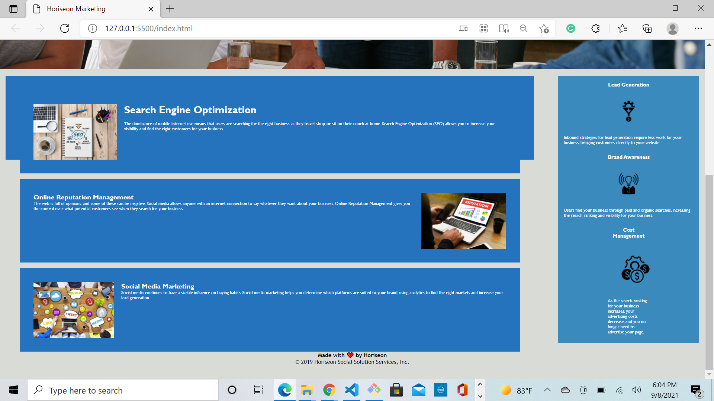

# refractoring-html-project

## Description

The objective of this project was to evaluate code given with the intention of improving it without changing actual aspects of the source. This exercise allowed me to engage in the source code to find ways to make it more effective and practice backwards engineering. The problem at hand was changing the elements of HTML from semantic to non-semantic code, which affected the CSS file because the selectors were still of the original code.
## Screenshots

https://github.com/matt-cross23/refractoring-html-project

